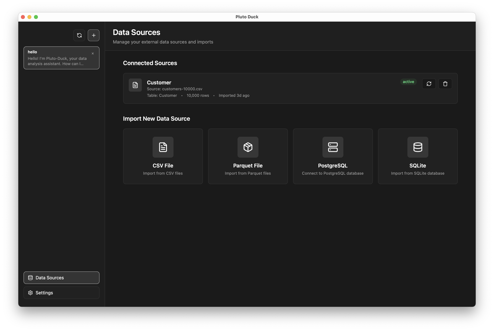

# Pluto-Duck OSS

Local-first analytics studio powered by DuckDB and an AI-assisted query agent.

<p align="center">
  
  
</p>

## Product Vision

**Pluto Duck** is a **local-first data analytics environment** for individuals and small teams.
Get powerful analytics capabilities without uploading your data to the cloud.

### Core Values

- **🔒 Privacy First**: All data and computation stay on your local machine, never transmitted externally
- **💬 Natural Language Queries**: Ask questions and get insights by conversing with an AI agent
- **🚀 High Performance**: DuckDB-powered analytics engine handles large datasets with speed
- **🔌 Live Data Federation**: Connect PostgreSQL, SQLite, MySQL databases with zero-copy ATTACH
- **📊 Asset Management**: Save, version, and execute SQL analyses with automatic lineage tracking

## Product Direction

Pluto Duck evolves in stages, developing in the following directions:

1. **Personal Data IDE**: A comfortable local workspace for developers and data analysts
2. **Accessibility Expansion**: Multiple interfaces including CLI, web, and desktop applications
3. **Open Source First**: Transparent development growing with the community
4. **(Future) Hybrid Options**: Optional cloud capabilities for scalability when needed

## Project Layout

- `backend/pluto_duck_backend`: FastAPI service, data services, and AI agent.
- `backend/duckpipe`: Lightweight SQL pipeline library for analysis management.
- `packages/pluto_duck_cli`: Typer-based CLI entrypoint (`pluto-duck`).
- `frontend/pluto_duck_frontend`: Next.js web client with chat and board interfaces.

## Getting Started

```bash
python -m venv .venv
source .venv/bin/activate
pip install --upgrade pip
pip install -e .[dev]

# Run linters/tests
ruff check backend packages
mypy backend packages
pytest backend

# Run API locally
pluto-duck run

# Stream agent events for a natural-language question
pluto-duck agent-stream "List customers"
```

Agent responses are also available via `/api/v1/agent/{run_id}/events` as SSE streams. Each event carries structured JSON describing reasoning updates, tool outputs, and final summaries (see `docs/ARCHITECTURE.md`). For CLI instructions using a real GPT provider, refer to `docs/AGENT_CLI_GUIDE.md`.

## Desktop App (macOS)

### Development

```bash
# Start backend + frontend + Tauri in dev mode
./scripts/dev.sh
```

### Building

```bash
# Build unsigned .app (for local testing)
./scripts/build.sh

# Output:
# - tauri-shell/src-tauri/target/release/bundle/macos/Pluto Duck.app
# - tauri-shell/src-tauri/target/release/bundle/dmg/Pluto Duck_0.1.0_aarch64.dmg
```

## Roadmap Highlights

- ✅ Phase 1: Clean OSS backend with public API and CLI
- ✅ Phase 2: Chat frontend with multi-board interface
- ✅ Phase 3: macOS desktop app with Tauri
- ✅ Phase 4: **New Data Architecture**
  - Live data federation via DuckDB ATTACH
  - duckpipe: lightweight SQL pipeline library
  - Asset management with lineage tracking

See `docs/plans/` for detailed design notes and `docs/Pluto_Duck_new_flow.md` for the new architecture.

